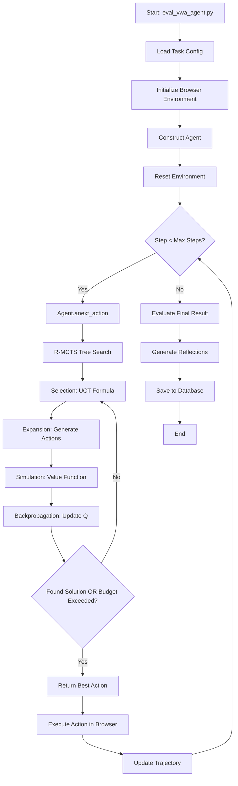
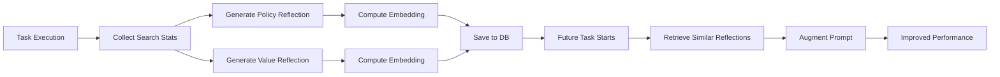

# ExACT VisualWebArena (VWA) Codebase Documentation

**Comprehensive Technical Documentation for the ExACT VWA Branch**

This document provides an extremely detailed explanation of the ExACT codebase on the VWA branch, covering how experiments are run, how the tree search works, what LLMs are used, how prompts are constructed, and how tasks are evaluated.

---

## Table of Contents

1. [Overview](#overview)
2. [Architecture](#architecture)
3. [How to Run an Experiment](#how-to-run-an-experiment)
4. [Entry Points and Evaluation Scripts](#entry-points-and-evaluation-scripts)
5. [Agent Implementations](#agent-implementations)
6. [Environment and Browser Interface](#environment-and-browser-interface)
7. [Monte Carlo Tree Search (MCTS) Algorithm](#monte-carlo-tree-search-mcts-algorithm)
8. [Prompt Construction](#prompt-construction)
9. [LLM Configuration and API Providers](#llm-configuration-and-api-providers)
10. [Value Functions and State Evaluation](#value-functions-and-state-evaluation)
11. [Reflective Learning (R-MCTS)](#reflective-learning-r-mcts)
12. [Evaluation and Scoring](#evaluation-and-scoring)
13. [Parallel Execution](#parallel-execution)
14. [Code Flow Diagrams](#code-flow-diagrams)
15. [Key Configuration Parameters](#key-configuration-parameters)

---

## Overview

**ExACT** (Exploration and Contrastive Learning for AI Agents) implements Reflective Monte Carlo Tree Search (R-MCTS) with multi-agent debate for state evaluation. The system enables AI agents to navigate and interact with websites in the VisualWebArena benchmark.

### Key Features:
- **R-MCTS**: Monte Carlo Tree Search with contrastive reflection
- **Multi-Agent Debate**: Multiple LLM instances debate to evaluate state values
- **Multimodal Input**: Processes both text (accessibility trees) and images (screenshots with Set-of-Mark)
- **Exploratory Learning**: Trains models to explore, evaluate states, and backtrack
- **Reflective Memory**: Stores and retrieves past task experiences to improve future performance

---

## Architecture

```
┌─────────────────────────────────────────────────────────────────┐
│                     Entry Point: eval_vwa_agent.py              │
└────────────┬────────────────────────────────────────────────────┘
             │
             ▼
┌─────────────────────────────────────────────────────────────────┐
│                   Agent Factory                                  │
│  (construct_reinforced_agent @ agent_factory.py:150-200)       │
│   • Creates RMCTSAgent or RMCTSwDBTAgent                       │
│   • Initializes Policy and Value Functions                      │
└────────────┬────────────────────────────────────────────────────┘
             │
             ▼
┌──────────────────────────┬──────────────────────────────────────┐
│   Policy (Action Gen)    │     Value Func (State Eval)          │
│ ReinforcedPromptMixin    │  ReinforcedDebateValueFunction       │
│  • Retrieves reflections │   • Multi-agent debate               │
│  • Constructs prompts    │   • Supporting/Opposing opinions     │
│  • Generates actions     │   • Final consensus value            │
└────────────┬─────────────┴──────────────────┬───────────────────┘
             │                                │
             ▼                                ▼
┌─────────────────────────────────────────────────────────────────┐
│                    MCTS Agent (rmcts_agent.py)                  │
│  • search() - Tree search iteration                            │
│  • _expansion() - Generate child actions                       │
│  • _simulation() - Evaluate state value                        │
│  • UCT selection - Balance exploration/exploitation            │
└────────────┬────────────────────────────────────────────────────┘
             │
             ▼
┌─────────────────────────────────────────────────────────────────┐
│         Browser Environment (FastCachedwActionMatchingBrowserEnv)│
│  • Playwright-based browser control                            │
│  • Action caching for search efficiency                        │
│  • Action matching to handle non-determinism                   │
│  • Accessibility tree + Screenshot observation                  │
└─────────────────────────────────────────────────────────────────┘
```

---

## How to Run an Experiment

### Quick Start Example

The simplest way to run an experiment is using the example shell script:

**File: `shells/example.sh` (Lines 1-86)**

```bash
#!/bin/bash
export PYTHONPATH=$(pwd)
export DATASET=visualwebarena

# Configure LLM providers
export PROVIDER="openai"
export AGENT_LLM_API_BASE="https://api.openai.com/v1"
export AGENT_LLM_API_KEY="$(echo $OPENAI_API_KEY)"
export VALUE_FUNC_PROVIDER="openai"
export VALUE_FUNC_API_BASE="https://api.openai.com/v1"

# Model configuration
model="gpt-4o"
agent="rmcts_mad"  # R-MCTS with Multi-Agent Debate

# Search configuration
max_depth=4
max_steps=5
branching_factor=5      # How many actions to explore per state
vf_budget=20           # Max value function calls per search
time_budget=2.5        # Soft time limit per step (minutes)

# Task to run
test_idx="10,11,70,71"

# Run evaluation
python runners/eval/eval_vwa_ragent.py \
  --instruction_path src/prompts/vwa/jsons/p_som_cot_id_actree_3s_final.json \
  --test_idx $test_idx \
  --model $model \
  --agent_type $agent \
  --branching_factor $branching_factor \
  --vf_budget $vf_budget \
  --max_steps $max_steps \
  --action_set_tag som \
  --observation_type image_som \
  --result_dir data/visualwebarena/eval_results/rmcts_som/example
```

### What Happens When You Run This:

1. **Environment Setup** (Lines 204-300 in `envs/browser.py`):
   - Playwright launches a headless Chromium browser
   - Loads task configuration from `configs/visualwebarena/test_classifieds_v2/10.json`
   - Sets viewport to 1280x2048 pixels
   - Navigates to starting URL

2. **Task Loading** (Lines 173-221 in `runners/eval/eval_vwa_agent.py`):
   ```python
   with open(config_file) as f:
       _c = json.load(f)
       intent = _c["intent"]  # e.g., "Find the cheapest pink dress"
       task_id = _c["task_id"]
       image_paths = _c.get("image", None)
   ```

3. **Agent Initialization** (Lines 510-513 in `runners/eval/eval_vwa_agent.py`):
   - Constructs the R-MCTS agent with specified configuration
   - Loads prompt templates
   - Initializes policy and value functions

4. **Evaluation Loop** (Lines 248-390 in `runners/eval/eval_vwa_agent.py`):
   - Calls `agent.anext_action()` to get next action via tree search
   - Executes action in browser environment
   - Continues until task completion or max steps reached

---

## Entry Points and Evaluation Scripts

### 1. Main Evaluation Script: `runners/eval/eval_vwa_agent.py`

This is the primary entry point for running single or sequential task evaluations.

#### Key Functions:

##### `aevaluate_single_task()` (Lines 141-446)
**Purpose**: Evaluates a single VWA task using the agent.

**Flow**:
```python
async def aevaluate_single_task(
    eval_args: EvalArguments,
    agent_args: ReinforcedAgentArguments,
    config_file: str,
    eval_caption_image_fn,
    early_stop_thresholds: dict[str, int],
    caption_image_fn,
    agent: FastAgent
):
    # 1. Create environment (Line 150)
    env = FastCachedwActionMatchingBrowserEnv(
        headless=not eval_args.render,
        action_set_tag=agent_args.action_set_tag,
        observation_type=eval_args.observation_type,
        viewport_size={"width": 1280, "height": 2048},
        sleep_after_execution=eval_args.sleep_after_execution,
        captioning_fn=caption_image_fn,
    )

    # 2. Load task config (Lines 174-221)
    with open(config_file) as f:
        _c = json.load(f)
        intent = _c["intent"]
        task_id = _c["task_id"]
        images = []  # Load task input images if any

    # 3. Reset agent for new task (Line 234)
    agent.reset(config_file)
    agent.on_task_start(task_info=task_info)

    # 4. Reset environment (Line 242)
    obs, info = await env.areset(options={"config_file": config_file})

    # 5. Main evaluation loop (Lines 248-390)
    step_idx = 0
    while True:
        step_idx += 1

        # Check early stopping conditions (Lines 250-252)
        early_stop_flag, stop_info = early_stop(
            trajectory, max_steps, early_stop_thresholds
        )

        if early_stop_flag:
            action = create_stop_action(f"Early stop: {stop_info}")
        else:
            # Get next action from agent via tree search (Lines 270-275)
            action = await agent.anext_action(
                trajectory,
                intent,
                meta_data=meta_data,
                additional_inputs=other_maybe_useful_inputs
            )

        # Execute action in environment (Line 367)
        obs, success, terminated, _, info = await env.astep(action)

        # Update trajectory
        trajectory.append(action)
        trajectory.append({"observation": obs, "info": info, "url": env.page.url})

        if terminated:
            break

    # 6. Evaluate final result (Lines 394-401)
    evaluator = evaluator_router(config_file, captioning_fn=eval_caption_image_fn)
    score = await evaluator(
        trajectory=trajectory,
        config_file=config_file,
        page=env.page
    )

    # 7. Agent post-task processing (Lines 404-409)
    agent.on_task_end(
        trajectory=trajectory,
        score=score,
        task_info=task_info,
        meta_data=meta_data,
    )

    return score
```

**Early Stopping** (Lines 82-135 in `envs/browser.py`):
- Stops if max steps reached
- Stops if parsing failed K times consecutively
- Stops if same action repeated K times

---

### 2. Parallel Evaluation Script: `runners/eval/eval_vwa_parallel.py`

Enables running multiple tasks in parallel with automatic environment resetting.

#### Key Features:

**1. Parallel Execution** (Lines 697-751):
```python
def greedy_parallel_run(args: CommonArgs):
    # Calculate all task indices to run
    all_run_indices = get_all_run_task_indices(
        all_task_indices,
        num_parallel=args.num_parallel,
        num_task_per_script=args.num_task_per_script
    )

    # Round-robin LLM providers across workers
    all_run_providers = get_all_run_providers(
        args.main_api_providers,
        num_scheduled_runs=len(all_run_indices)
    )

    # Execute in parallel using ThreadPoolExecutor
    with ThreadPoolExecutor(max_workers=args.num_parallel) as executor:
        futures = []
        for task_indices, api_provider in zip(all_run_indices, all_run_providers):
            future = executor.submit(
                run_single_script,
                args.env_name,
                task_indices,
                api_provider,
                args.save_dir,
                args.eval_script
            )
            futures.append(future)

        # Monitor and reset environment periodically
        for future in futures:
            result = future.result()
            finished_indices.update(result['test_indices'])

            # Reset environment every N tasks (Line 746)
            if prev_num_finished * 2 >= args.num_task_per_reset:
                refresh_env_login()
                reset_env(args.env_name)
```

**2. Dynamic Script Generation** (Lines 437-454):
```python
# Template replacement for parallel runs
eval_shell_command = eval_shell_command.replace(
    "[[[API_PROVIDER_ENV_VARS]]]",
    AVAILABLE_API_PROVIDERS[provider]
)
eval_shell_command = eval_shell_command.replace(
    "[[[test_idx]]]",
    ",".join([str(idx) for idx in test_indices])
)
eval_shell_command = eval_shell_command.replace(
    "[[[SAVE_ROOT_DIR]]]",
    save_dir
)
```

**Example Usage**:
```bash
python runners/eval/eval_vwa_parallel.py \
  --env_name classifieds \
  --save_dir data/visualwebarena/eval_results/rmcts_som/gpt-4o_classifieds \
  --eval_script shells/classifieds/rmcts_mad_som.sh \
  --run_mode greedy \
  --start_idx 0 \
  --end_idx 234 \
  --num_parallel 2 \
  --main_api_providers openai,openai \
  --num_task_per_script 2 \
  --num_task_per_reset 8
```

---

## Agent Implementations

### 1. Base Agent: `src/agent/base_agent.py`

All agents inherit from `FastAgent` or `PromptAgent`.

#### PromptAgent (Lines 66-194)
**Purpose**: Basic prompt-based agent that generates single actions.

```python
class PromptAgent(FastAgent):
    def __init__(
        self,
        action_set_tag: str,
        lm_config: lm_config.LMConfig,
        prompt_constructor: PromptConstructor,
        captioning_fn = None,
    ) -> None:
        self.lm_config = lm_config
        self.prompt_constructor = prompt_constructor
        self.action_set_tag = action_set_tag

        # Check if multimodal (Line 84)
        if is_vlm(self.lm_config) and prompt_constructor.is_multimodal:
            self.multimodal_inputs = True
```

**Action Generation** (Lines 96-191):
```python
async def anext_action(
    self,
    trajectory: Trajectory,
    intent: str,
    meta_data: dict[str, Any],
    additional_inputs: dict[str, Any]
) -> Action:
    task_info = additional_inputs["task_info"]
    images: Optional[list[Image.Image]] = task_info["images"]
    state_info: StateInfo = trajectory[-1]

    # Get page screenshot for multimodal models (Lines 112-116)
    if self.multimodal_inputs:
        page_screenshot_arr = trajectory[-1]["observation"]["image"]
        page_screenshot_img = Image.fromarray(page_screenshot_arr)

    # Construct prompt (Lines 138-144)
    if self.multimodal_inputs:
        prompt = self.prompt_constructor.construct(
            trajectory, intent, page_screenshot_img, images, meta_data
        )
    else:
        prompt = self.prompt_constructor.construct(
            trajectory, intent, meta_data
        )

    # Query LLM (Line 148)
    response = call_llm(lm_config, prompt, num_outputs=1)

    # Parse response into action (Lines 157-169)
    parsed_response = self.prompt_constructor.extract_action(response)
    if self.action_set_tag == "id_accessibility_tree":
        action = create_id_based_action(parsed_response)
    elif self.action_set_tag == "som":  # Set-of-Mark
        action = create_id_based_action(parsed_response)

    return action
```

---

### 2. MCTS Agent: `src/agent/mcts_agent.py`

Implements basic Monte Carlo Tree Search without reflection.

#### Node Structure (Lines 38-89)
```python
@dataclass
class Node:
    env: FastCachedwActionMatchingBrowserEnv  # Environment state
    trajectory: Trajectory                     # Full trajectory
    action_trajectory: list[Action]           # Actions taken
    action_trajectory_str: list[str]          # String rep for hashing
    value: float                              # State value estimate
    children: dict[Action, 'Node']            # Child states
    Ns: int = 0                              # Visit count
    depth: int = 0                           # Tree depth
    is_root: bool = False
    is_terminal: bool = False

    def _to_string_rep(self) -> str:
        """Hash function for state identity"""
        return ' -> '.join(self.action_trajectory_str)
```

#### Core MCTS Algorithm

**Search Iteration** (Lines in `mcts_agent.py`):
```python
async def search(self, state: Node):
    """One iteration: selection, expansion, simulation, backpropagation"""
    hashable_state = state._to_string_rep()

    # 1. Check if terminal (Lines 410-421)
    if state.is_terminal:
        if state._need_evaluation:
            await self._simulation(state)
        return state.value
    elif state.value == 1.0:
        self.found_success_trajectory = True
        return state.value
    elif len(state.children) == 0:
        # Leaf node: expand and simulate
        self._expansion(state)
        await self._simulation(state)
        return state.value

    # 2. Selection - Choose best child using UCT (Lines 429-448)
    best_uct = -float('inf')
    best_action = None
    for a in state.children.keys():
        Ns = self.Ns[hashable_state]
        qsa = self.Q[hashable_state][a]
        p = self.P[hashable_state][a]  # Prior probability
        nsa = self.Nsa[hashable_state][a]

        # UCT formula (Line 440)
        if Ns == 0:
            uct = qsa + self.cpuct * p
        else:
            uct = qsa + self.cpuct * p * math.sqrt(Ns) / (1 + nsa)

        if uct > best_uct:
            best_uct = uct
            best_action = a

    # 3. Transition to next state (Line 452-453)
    self.best_action_cache.append(best_action)
    next_state = await self._get_next_state(state, best_action)

    # 4. Recursively search (Line 458)
    v = await self.search(next_state)

    # 5. Backpropagation - Update Q-values (Lines 464-468)
    self.Q[hashable_state][best_action] = (
        self.Nsa[hashable_state][best_action] * self.Q[hashable_state][best_action] + v
    ) / (self.Nsa[hashable_state][best_action] + 1)
    self.Nsa[hashable_state][best_action] += 1
    self.Ns[hashable_state] += 1

    return v
```

**Action Generation** (Lines 273-400):
```python
def _gen_next_actions(
    self,
    trajectory: Trajectory,
    intent: str,
    meta_data: dict[str, Any],
    images: Optional[list[Image.Image]] = None,
) -> list[Action]:
    """Generate multiple candidate actions for expansion"""

    # Construct prompt
    if self.multimodal_inputs:
        prompt = self.prompt_constructor.construct(
            trajectory, intent, page_screenshot_img, images, meta_data
        )

    # Sample multiple completions (Line 320-324)
    responses = call_llm(
        lm_config,
        prompt,
        num_outputs=max(self.branching_factor * 2, 20)
    )

    # Parse and deduplicate actions (Lines 334-366)
    all_actions = {}
    all_actions_count = {}
    for response in responses:
        parsed_response = self.prompt_constructor.extract_action(response)
        action = create_id_based_action(parsed_response)
        action_hash = get_action_description(action, ...)

        if action_hash in all_actions:
            all_actions_count[action_hash] += 1
        else:
            all_actions[action_hash] = action
            all_actions_count[action_hash] = 1

    # Select top branching_factor actions (Lines 381-390)
    top_action_hashes = sorted(
        all_actions_count,
        key=all_actions_count.get,
        reverse=True
    )[:self.branching_factor]

    # Compute prior probabilities from sampling frequency
    top_action_count = sum([all_actions_count[h] for h in top_action_hashes])
    for action_hash in top_action_hashes:
        a = all_actions[action_hash]
        a['prob'] = all_actions_count[action_hash] / top_action_count

    return updated_actions
```

---

### 3. R-MCTS Agent: `src/agent/rmcts_agent.py`

Extends MCTS with reflective learning and memory.

#### Key Enhancements:

**1. Task Start Hook** (Lines 78-84):
```python
def on_task_start(self, task_info: dict, **kwargs) -> None:
    """Called before starting a new task"""
    prompt_constructor: ReinforcedPromptMixin = self.prompt_constructor
    prompt_constructor.on_task_start(task_info)

    value_function: ReinforcedValueFunctionMixin = self.value_function
    value_function.on_task_start(task_info)
```

**2. Reflection Retrieval** (Lines 86-104):
```python
def _gen_next_actions(
    self,
    trajectory: Trajectory,
    intent: str,
    meta_data: dict[str, Any],
    images: Optional[list[Image.Image]] = None,
) -> list[Action]:
    """Generate actions with reflection retrieval"""
    actions = super(RMCTSAgent, self)._gen_next_actions(
        trajectory, intent, meta_data, images
    )

    # Retrieve relevant reflections from memory (Lines 96-103)
    prompt_constructor: ReinforcedPromptMixin = self.prompt_constructor
    state_info = trajectory[-1]
    curr_obs = state_info["observation"]
    retrieved_reflections = prompt_constructor._retrieval_cache.get(
        (intent, curr_obs["text"]), []
    )

    # Attach reflections to action metadata
    simpl_reflections = [r.simplified_info() for r in retrieved_reflections]
    for a in actions:
        a.metadata['retrieved_reflections'] = simpl_reflections

    return actions
```

**3. State Value Simulation** (Lines 106-158):
```python
async def _simulation(self, state: Node) -> float:
    """Evaluate state value using value function"""
    if state.is_root:
        return 0.0

    v_model = self.value_function_model
    intent = state._additional_info['intent']
    images = state._additional_info.get('images', [])
    init_screenshot = Image.fromarray(state.trajectory[0]["observation"]["image"])

    # Collect all screenshots in trajectory (Lines 115-119)
    all_screenshots = []
    for data in state.trajectory:
        if isinstance(data, dict):
            all_screenshots.append(Image.fromarray(data["observation"]["image"]))

    # Get action history
    all_actions_str = state._additional_info['meta_data']['action_history']
    if all_actions_str[0].lower() == "none":
        all_actions_str = all_actions_str[1:]

    # Call value function (Lines 128-148)
    v = self.value_function.evaluate_success(
        screenshots=all_screenshots,
        actions=copy.deepcopy(all_actions_str),
        current_url=state.env.page.url,
        last_reasoning="",
        intent=intent,
        models=["gpt-4o-2024-05-13"],
        init_screenshot=init_screenshot,
        intent_images=images if len(images) > 0 else None
    )

    # Update node
    state.value = v
    state.Ns += 1
    state._need_evaluation = False

    return v
```

**4. Task End Hook** (Lines 161-182):
```python
def on_task_end(
    self,
    trajectory: Trajectory,
    score: float,
    task_info: dict,
    meta_data: Any,
    **kwargs
) -> None:
    """Called after task completes - save reflections"""
    prompt_constructor: ReinforcedPromptMixin = self.prompt_constructor
    value_function: ReinforcedValueFunctionMixin = self.value_function

    # Extract all actions from trajectory
    all_actions: list[Action] = []
    for data in trajectory:
        if isinstance(data, Action):
            if 'Early stop' in data.answer:
                continue
            all_actions.append(data)

    # Collect search tree statistics (Lines 172-177)
    search_tree_stats = {
        'Q': [a.metadata.get('Q', 0.0) for a in all_actions],
        'Nsa': [a.metadata.get('Nsa', 0.0) for a in all_actions],
        'P': [a.metadata.get('P', 0.0) for a in all_actions],
        'V_next': [a.metadata.get('V_next', 0.0) for a in all_actions],
    }

    # Generate and save reflections (Lines 180-181)
    value_function.on_task_end(
        trajectory, score, task_info, meta_data,
        search_tree_stats=search_tree_stats
    )
    prompt_constructor.on_task_end(
        trajectory, score, task_info, meta_data,
        search_tree_stats=search_tree_stats
    )
```

---

### 4. R-MCTS with Debate Agent: `src/agent/rmcts_agent.py` (RMCTSwDBTAgent)

Adds multi-agent debate for more reliable value estimation.

**Key Addition** (Lines 332-400):
```python
async def _simulation(self, state: Node) -> float:
    """State evaluation with debate-based value function"""

    # ... (same setup as R-MCTS)

    # Call debate-based value function (Lines 356-378)
    v = self.value_function.evaluate_success(
        screenshots=all_screenshots,
        screenshots_text=all_screenshots_text,  # TEXT observation added
        actions=copy.deepcopy(all_actions_str),
        current_url=state.env.page.url,
        intent=intent,
        models=["gpt-4o"],
        init_screenshot=init_screenshot,
        intent_images=images if len(images) > 0 else None
    )

    # Save debate data to node for visualization (Lines 390-399)
    v_func: DebateBasedValueFunctionMixin = self.value_function
    v_func_data_key = v_func._encode_eval_success_input(
        all_screenshots,
        copy.deepcopy(all_actions_str),
        intent,
        images if len(images) > 0 else []
    )
    v_func_data = v_func._debate_cache.get(v_func_data_key, {})
    state._additional_info['debate_data'] = v_func_data

    return v
```

---

## Environment and Browser Interface

### Browser Environment: `src/envs/browser.py`

#### 1. FastCachedwActionMatchingBrowserEnv (Lines 635-784)

**Purpose**: Provides an efficient, deterministic browser environment for tree search.

**Key Features**:
- **Action Caching**: Reuses observation computations when revisiting states
- **Action Matching**: Handles non-determinism by mapping actions to similar elements
- **Accessibility Tree**: Text-based page representation
- **Set-of-Mark (SoM)**: Visual element marking with numeric IDs

**Initialization** (Lines 462-517):
```python
class FastCachedBrowserEnv(FastBrowserEnv):
    def __init__(
        self,
        max_page_length: int = 8192,
        headless: bool = True,
        slow_mo: int = 0,
        action_set_tag: str = "id_accessibility_tree",
        observation_type: str = "html",
        current_viewport_only: bool = False,
        viewport_size: ViewportSize = {"width": 1280, "height": 720},
        save_trace_enabled: bool = False,
        sleep_after_execution: float = 0.0,
        captioning_fn=None,
    ):
        self.action_set_tag = action_set_tag

        # Observation handler (Lines 505-512)
        self.observation_handler = FastCachedObservationHandler(
            self.main_observation_type,
            self.text_observation_type,
            self.image_observation_type,
            self.current_viewport_only,
            self.viewport_size,
            captioning_fn,
        )
```

**State Hashing for Caching** (Lines 428-451):
```python
async def hash_page(
    page: Page,
    action_history: list[Action],
    action_set_tag: str
):
    """Generate unique hash for current page state"""

    # Include action history (important for scroll position)
    act_hist_str = actionhistory2str(action_history, action_set_tag)

    # Get accessibility tree to detect content changes (Lines 437-441)
    client = await page.context.new_cdp_session(page)
    _resp = await client.send("Accessibility.getFullAXTree", {})
    accessibility_tree = _resp["nodes"]

    # Extract and hash all nodes (Lines 442-447)
    all_nodes = []
    for node in accessibility_tree:
        all_nodes.append((str(node["nodeId"]), str(node["role"]["value"])))
    all_nodes.sort(key=lambda x: x[0])
    node_hashed = hashlib.sha256(str(all_nodes).encode('utf-8')).hexdigest()

    # Combined hash
    hash_code = f"{act_hist_str=}::{node_hashed=}"
    return hash_code
```

**Cached Observation** (Lines 610-616):
```python
async def _aget_obs(self) -> dict[str, Observation]:
    """Get observation with caching"""
    obs = await self.observation_handler.cached_aget_observation(
        self.page,
        cache_id=self.page_hash  # Use state hash as cache key
    )
    return obs
```

**Action Matching** (Lines 642-753):
```python
def maybe_update_action_id(self, action: Action, info: dict = None) -> Action:
    """Handle element ID changes due to page non-determinism"""

    # Get current environment's element IDs
    env_obs_metadata = self._curr_obs['info']['observation_metadata']
    env_obs_nodes_info = env_obs_metadata['image'].get('obs_nodes_semantic_info', {})

    # Get action's expected element ID
    action_element_id = action.element_id
    if action_element_id == '':
        return action

    # Check if element still exists at same ID (Lines 683-694)
    if action_element_id in env_obs_nodes_info:
        env_node = {'text': env_obs_nodes_info[action_element_id]}
        action_node = {'text': action_obs_nodes_info[action_element_id]}
        if is_same_element(env_node, action_node):
            return action  # No update needed

    # Search nearby IDs for matching element (Lines 700-750)
    error_margin = int(0.1 * len(action_obs_nodes_info))
    action_element_id_offset = int(action_element_id) - action_min_node_id
    env_min_node_id = min([int(k) for k in env_obs_nodes_info.keys()])

    for i in range(error_margin+1):
        possible_id = str(action_element_id_offset + env_min_node_id + i)
        if possible_id in env_obs_nodes_info:
            if is_same_element(env_node, action_node):
                # Update action with new ID (Lines 720-726)
                action.element_id = possible_id
                action.raw_prediction = previous_raw_prediction.replace(
                    f"[{action_element_id}]", f"[{possible_id}]"
                )
                break

    return action
```

**Element Similarity** (Lines 619-632):
```python
def is_same_element(element_a: dict, element_b: dict):
    """Check if two elements are semantically the same"""

    # Remove ID prefixes like "[123]" (Lines 620-623)
    a_text = element_a['text'].lower()
    a_text = a_text[a_text.find(' ') + 1:]
    b_text = element_b['text'].lower()
    b_text = b_text[b_text.find(' ') + 1:]

    # Word overlap heuristic (Lines 625-631)
    a_words = set(a_text.split())
    b_words = set(b_text.split())
    num_similar_words = len(a_words.intersection(b_words))

    if num_similar_words / len(a_words) >= 0.75:
        return True
    return False
```

---

### Action Execution: `src/envs/actions.py`

Actions follow this type definition:
```python
class Action(TypedDict):
    action_type: ActionTypes  # CLICK, TYPE, SCROLL, GOTO, STOP, etc.
    element_id: str          # Element to interact with
    value: str               # Value for TYPE actions
    answer: str              # Answer for STOP actions
    raw_prediction: str      # Original LLM response
    metadata: dict           # Additional info (obs_metadata, reflections, etc.)
```

**Action Types** (in `browser_env`):
- `CLICK [id]` - Click element
- `TYPE [id] [content] [1/0]` - Type text (with/without Enter)
- `SCROLL [up/down]` - Scroll page
- `GOTO [url]` - Navigate to URL
- `STOP [answer]` - Complete task with answer
- `HOVER [id]` - Hover over element

---

## Monte Carlo Tree Search (MCTS) Algorithm

### Algorithm Overview

R-MCTS performs iterative tree search to find optimal action sequences:

```
Root State (s₀)
    ├─ Action a₁ (Q=0.8, N=10) → State s₁
    │   ├─ Action a₃ (Q=0.9, N=5) → State s₃
    │   └─ Action a₄ (Q=0.7, N=5) → State s₄
    └─ Action a₂ (Q=0.6, N=8) → State s₂
        └─ Action a₅ (Q=0.5, N=3) → State s₅
```

### MCTS Statistics

For each state-action pair (s, a), the algorithm maintains:

- **Q(s,a)**: Average value (reward) obtained after taking action a in state s
- **N(s,a)**: Number of times action a was selected in state s
- **N(s)**: Total number of times state s was visited
- **P(s,a)**: Prior probability of action a (from LLM sampling frequency)

**Storage** (Lines 254-263 in `mcts_agent.py`):
```python
self.Ns: dict = {}   # Ns[state_hash] = visit_count
self.Nsa: dict = {}  # Nsa[state_hash][action] = action_visit_count
self.Q: dict = {}    # Q[state_hash][action] = average_value
self.P: dict = {}    # P[state_hash][action] = prior_probability
```

### Search Phases

#### 1. Selection (UCT Formula)

**Choose action with highest Upper Confidence Bound** (Lines 432-448):
```python
for a in state.children.keys():
    Ns = self.Ns[hashable_state]
    qsa = self.Q[hashable_state][a]
    p = self.P[hashable_state][a]
    nsa = self.Nsa[hashable_state][a]

    # UCT = Exploitation + Exploration
    if Ns == 0:
        uct = qsa + self.cpuct * p
    else:
        uct = qsa + self.cpuct * p * sqrt(Ns) / (1 + nsa)

    if uct > best_uct:
        best_uct = uct
        best_action = a
```

**UCT Formula**:
```
UCT(s, a) = Q(s, a) + c_puct * P(s, a) * sqrt(N(s)) / (1 + N(s, a))
            └─────┘   └──────────────────────────────────────────┘
          Exploitation              Exploration

Where:
- Q(s,a): Average value (rewards agent has seen)
- c_puct: Exploration constant (default 1.0)
- P(s,a): Prior probability from LLM
- N(s): Parent visit count
- N(s,a): Action visit count
```

**Intuition**:
- High Q(s,a) → Action has high average value
- High P(s,a) → LLM thinks this action is good
- Low N(s,a) → Action is under-explored
- Balance: Exploit good actions vs. explore uncertain ones

#### 2. Expansion

**Generate child actions** (Lines 273-400 in `mcts_agent.py`):
```python
def _gen_next_actions(...) -> list[Action]:
    # Sample multiple completions from LLM
    responses = call_llm(lm_config, prompt, num_outputs=20)

    # Parse and count action occurrences
    all_actions_count = {}
    for response in responses:
        action = create_id_based_action(parse(response))
        action_hash = get_action_description(action)
        all_actions_count[action_hash] = all_actions_count.get(action_hash, 0) + 1

    # Select top-k most frequent actions
    top_actions = sorted(all_actions_count, key=all_actions_count.get)[:branching_factor]

    # Compute prior probabilities
    for action in top_actions:
        action['prob'] = all_actions_count[action] / sum(all_actions_count.values())

    return top_actions
```

**Why sampling frequency as priors?**
When LLM is asked to sample N completions, actions that appear more frequently are likely better according to the model's learned distribution.

#### 3. Simulation (Value Estimation)

**Evaluate leaf state using value function** (Lines 106-158 in `rmcts_agent.py`):
```python
async def _simulation(self, state: Node) -> float:
    # Collect trajectory
    all_screenshots = [s["observation"]["image"] for s in state.trajectory if isinstance(s, dict)]
    all_actions_str = state._additional_info['meta_data']['action_history']

    # Call value function with multi-agent debate
    v = self.value_function.evaluate_success(
        screenshots=all_screenshots,
        actions=all_actions_str,
        current_url=state.env.page.url,
        intent=intent,
        models=["gpt-4o"],
        init_screenshot=init_screenshot,
        intent_images=images
    )

    state.value = v
    return v
```

#### 4. Backpropagation

**Update Q-values along the search path** (Lines 464-468):
```python
# Incremental average update
self.Q[hashable_state][best_action] = (
    self.Nsa[hashable_state][best_action] * self.Q[hashable_state][best_action] + v
) / (self.Nsa[hashable_state][best_action] + 1)

self.Nsa[hashable_state][best_action] += 1
self.Ns[hashable_state] += 1
```

**Mathematical interpretation**:
```
Q_new(s,a) = (N(s,a) * Q_old(s,a) + v) / (N(s,a) + 1)
           = Q_old(s,a) + (v - Q_old(s,a)) / (N(s,a) + 1)
```
This is an incremental running average update.

### Budget Control

**Two budgets control search duration**:

1. **Value Function Budget** (Lines in evaluation loop):
```python
# Soft budget: target number of value function calls
vf_budget = 20

while vf_calls < vf_budget and not found_success:
    await agent.search(root_state)
    vf_calls += 1
```

2. **Time Budget** (Lines in evaluation loop):
```python
# Soft maximum: time limit per step
time_budget = 2.5  # minutes

start_time = time.time()
while time.time() - start_time < time_budget * 60:
    await agent.search(root_state)
```

### Final Action Selection

**After search completes, select best action**:
```python
# Choose action with highest Q-value (exploitation only)
best_q = -float('inf')
best_action = None
for action in root.children.keys():
    q = self.Q[root._to_string_rep()][action]
    if q > best_q:
        best_q = q
        best_action = action

return best_action
```

---

## Prompt Construction

### Multimodal Prompts: `src/agentic/policy.py`

#### Prompt Structure

R-MCTS uses multimodal prompts combining:
1. **System Message**: Task instructions
2. **Few-shot Examples**: 2-3 demonstration trajectories
3. **Current Trajectory**: Recent state-action pairs
4. **Intent**: User's goal
5. **Intent Images**: Reference images (if any)
6. **Current Observation**: Accessibility tree or SoM image
7. **Retrieved Reflections**: Past relevant experiences

#### Example Prompt Construction (Lines 206-300 in `policy.py`):
```python
def get_lm_api_input(
    self,
    intro: str,
    examples: list[tuple[str, str, str]],
    intent: str,
    intent_image: list[Image.Image],
    all_prev_state_actions: Trajectory,
    all_prev_action_strs: list[str],
    context_specific_instruction: str,  # Reflections
):
    message = [
        {
            "role": "system",
            "content": [{"type": "text", "text": intro}],
        }
    ]

    # Add few-shot examples (Lines 232-259)
    for (obs_text, action_text, image_path) in examples:
        example_img = Image.open(image_path)
        message.append({
            "role": "user",
            "content": [
                {"type": "text", "text": obs_text},
                {"type": "text", "text": "IMAGES: (1) current page screenshot"},
                {"type": "image_url", "image_url": {"url": pil_to_b64(example_img)}},
            ],
        })
        message.append({
            "role": "assistant",
            "content": [{"type": "text", "text": action_text}],
        })

    # Add initial state (Lines 266-289)
    init_s = all_prev_state_actions[0]
    init_state_img = Image.fromarray(init_s["observation"]["image"])
    hist_init = f"!IMPORTANT! Below is the task you need to solve.\n{intent}"

    history_prompt = [{
        "role": "user",
        "content": [
            {"type": "text", "text": hist_init},
        ]
    }]

    # Add intent images
    for image_i, image in enumerate(intent_image):
        history_prompt[0]["content"].extend([
            {"type": "text", "text": f"({image_i+1}) input image {image_i+1}"},
            {"type": "image_url", "image_url": {"url": pil_to_b64(image)}},
        ])

    # Add reflections if available (context_specific_instruction)
    if context_specific_instruction:
        history_prompt[0]["content"].insert(0, {
            "type": "text",
            "text": context_specific_instruction
        })

    # Add current observation
    history_prompt[0]["content"].extend([
        {"type": "text", "text": "IMAGES: (1) current page screenshot"},
        {"type": "image_url", "image_url": {"url": pil_to_b64(init_state_img)}},
    ])

    message.extend(history_prompt)

    # Add trajectory history (state-action pairs)
    for i in range(1, len(all_prev_state_actions), 2):
        action_str = all_prev_action_strs[(i+1)//2]
        message.append({"role": "assistant", "content": [{"type": "text", "text": action_str}]})

        state_s = all_prev_state_actions[i+1]
        state_img = Image.fromarray(state_s["observation"]["image"])
        message.append({
            "role": "user",
            "content": [
                {"type": "text", "text": "IMAGES: (1) current page screenshot"},
                {"type": "image_url", "image_url": {"url": pil_to_b64(state_img)}},
            ]
        })

    return message
```

### Prompt Templates: `src/prompts/vwa/jsons/`

**Location**: `src/prompts/vwa/jsons/p_som_cot_id_actree_3s_final.json`

This JSON defines the prompt structure:
```json
{
  "intro": "You are an autonomous intelligent agent...",
  "examples": [
    ["example_obs_1.txt", "example_action_1.txt", "example_screenshot_1.png"],
    ["example_obs_2.txt", "example_action_2.txt", "example_screenshot_2.png"]
  ],
  "template": "OBJECTIVE: {objective}\nOBSERVATION:\n{observation}\nURL: {url}\nPREVIOUS ACTION: {previous_action}",
  "meta_data": {
    "observation_type": "image_som",
    "action_set_tag": "id_accessibility_tree",
    "answer_phrase": "In summary, the next action I will perform is"
  }
}
```

### Set-of-Mark (SoM) Representation

SoM overlays numeric markers on interactive elements in screenshots.

**Example**:
```
Original Screenshot:     SoM Screenshot:
┌─────────────────┐     ┌─────────────────┐
│  [Search Box]   │     │  [42] Search    │
│  [Submit]       │     │  [43] Submit    │
│  Product 1      │     │  [44] Product 1 │
│  Product 2      │     │  [45] Product 2 │
└─────────────────┘     └─────────────────┘
```

Agent output: `click [44]` to select Product 1.

---

## LLM Configuration and API Providers

### LM Config: `src/llms/lm_config.py`

**Configuration Object** (Lines 11-30):
```python
@dataclass(frozen=True)
class LMConfig:
    provider: str          # "openai", "azure", "sglang", "google"
    model: str            # "gpt-4o", "gpt-4o-mini", etc.
    mode: str             # "chat" or "completion"
    gen_config: dict      # Generation parameters
```

**Generation Config** (Lines 33-44):
```python
llm_config.gen_config = {
    "temperature": 1.0,      # Sampling randomness
    "top_p": 0.95,          # Nucleus sampling
    "max_tokens": 384,      # Max response length
    "context_length": 0,    # Max context (0 = unlimited)
    "max_obs_length": 3840, # Max observation tokens
    "max_retry": 3,         # Retry on API failure
}
```

### API Providers: `src/llms/providers/`

#### 1. OpenAI Provider (`openai_utils.py`)

**API Call** (with retry logic):
```python
def generate_from_openai_chat_completion(
    client: OpenAI,
    messages: list[dict],
    model: str,
    temperature: float = 0.9,
    max_tokens: int = 256,
    top_p: float = 1.0,
    num_outputs: int = 1,
):
    # Retry up to 6 times with exponential backoff
    for attempt in range(6):
        try:
            response = client.chat.completions.create(
                model=model,
                messages=messages,
                max_tokens=max_tokens,
                temperature=temperature,
                top_p=top_p,
                n=num_outputs
            )

            # Track token usage
            update_token_usage(
                model_name=model,
                token_stats={
                    'completion_tokens': response.usage.completion_tokens,
                    'prompt_tokens': response.usage.prompt_tokens,
                    'num_requests': 1
                },
                token_usage_tracker=TOKEN_USAGE
            )

            if num_outputs == 1:
                return response.choices[0].message.content
            else:
                return [choice.message.content for choice in response.choices]

        except Exception as e:
            if attempt < 5:
                sleep_time = 2 ** attempt  # Exponential backoff: 1s, 2s, 4s, 8s, 16s, 32s
                time.sleep(sleep_time)
            else:
                raise e
```

#### 2. Azure Provider

Uses Azure OpenAI with managed identity authentication:
```python
from azure.identity import DefaultAzureCredential, get_bearer_token_provider

azure_credential = DefaultAzureCredential()
token_provider = get_bearer_token_provider(
    azure_credential,
    os.environ["AZURE_TOKEN_PROVIDER_API_BASE"]
)

client = AzureOpenAI(
    api_version=os.environ["AZURE_OPENAI_API_VERSION"],
    azure_endpoint=os.environ["AZURE_OPENAI_API_BASE"],
    azure_ad_token_provider=token_provider
)
```

#### 3. sglang Provider

For hosting custom VLMs (e.g., Qwen-VL):
```python
client = OpenAI(
    api_key="sk-123456",  # Dummy key
    base_url="http://localhost:8000/v1"
)

# Add modality markers for multi-image support
messages = _add_modality_key_for_sglang_messages(messages)
```

### Provider Configuration: `configs/llms/providers.yaml`

```yaml
openai:
  provider: openai
  llm_api_base: https://api.openai.com/v1
  llm_api_key: ${OPENAI_API_KEY}

azure:
  provider: azure
  llm_api_base: ${AZURE_OPENAI_API_BASE}
  llm_api_version: ${AZURE_OPENAI_API_VERSION}
  token_provider_base: ${AZURE_TOKEN_PROVIDER_API_BASE}

sglang:
  provider: sglang
  llm_api_base: http://localhost:8000/v1
  llm_api_version: ''
```

---

## Value Functions and State Evaluation

Value functions estimate how close a state is to task completion.

### Value Function Hierarchy

```
ValueFunction (base)
    ├─ DirectCoTValueFunction         # Simple CoT evaluation
    ├─ CoTwRubricValueFunction        # CoT with task-specific rubrics
    └─ CoTwDebateValueFunction        # Multi-agent debate (BEST)
         ├─ ReinforcedRubricValueFunction     # + Reflective learning
         └─ ReinforcedDebateValueFunction     # + Reflective learning + Debate
```

### 1. Direct CoT Value Function

**Prompt Structure** (`value_function.py` Lines 133-164):
```
System: You are an expert in evaluating web navigation agents...

User: Intent: Find the cheapest pink dress
      [Intent Image]
      [Initial Screenshot]

Assistant: click [search_box]

User: [Screenshot after search]
A: type [input] "pink dress"

User: [Screenshot showing results]

A: click [cheapest_item]

User: Now evaluate if the agent's execution is successful.
      STATUS CODE: A, B, C, D, or E
      A = Success, task complete
      B = Very close, one action needed
      C = On right track, multiple actions needed
      D = Uncertain progress
      E = Not making progress / incorrect

A: type [input] "pink dress"

User: [Screenshot showing results]

A: click [cheapest_item]

User: Now evaluate if the agent's execution is successful.
      STATUS CODE: A, B, C, D, or E
      A = Success, task complete
      B = Very close, one action needed
      C = On right track, multiple actions needed
      D = Uncertain progress
      E = Not making progress / incorrect
```

**Implementation** (Lines 364-442):
```python
@time_it
@staticmethod
def evaluate_success(
    screenshots: list[Image.Image],
    actions: list[str],
    current_url: str,
    last_reasoning: str,
    intent: str,
    models: list[str],
    init_screenshot: Optional[Image.Image] = None,
    intent_images: Optional[list[Image.Image]] = None,
    n: int = 20,
    top_p: float = 1.0
) -> float:
    # Construct evaluation prompt
    messages = DirectCoTValueFunction._construct_prompt(
        screenshots=screenshots,
        actions=actions,
        last_state_url=current_url,
        intent=intent,
        intent_images=intent_images
    )

    # Query multiple models/samples for robustness (Lines 392-416)
    all_responses = []
    for model in models:
        response = client.chat.completions.create(
            model=model,
            messages=messages,
            max_tokens=256,
            top_p=top_p,
            n=n // len(models)  # Split samples across models
        )
        all_responses.extend(response.choices)

    # Parse responses to scores (Lines 419-438)
    all_scores = []
    for r in all_responses:
        pred = re.search(r'.*STATUS CODE: (\w).*', r.message.content).group(1)
        if 'A' in pred:
            score = 1.0      # Task complete
        elif 'B' in pred:
            score = 0.9      # Very close
        elif 'C' in pred:
            score = 0.5      # On track
        elif 'D' in pred:
            score = 0.2      # Uncertain
        else:
            score = 0.0      # Failure

        all_scores.append(score)

    # Average across all samples
    return np.mean(all_scores)
```

---

### 2. Rubric-Based Value Function

**Enhancement**: Generates task-specific rubrics before evaluation.

**Rubric Generation** (`value_function.py` Lines 822-861):
```python
@staticmethod
def generate_rubrics(
    intent: str,
    intent_images: Optional[list[Image.Image]],
    init_screenshot: Image.Image,
    model: str
) -> str:
    # Check cache (Lines 836-838)
    encoded_image_str = _pil_image_to_str(intent_images + [init_screenshot])
    if (intent, encoded_image_str) in CoTwRubricValueFunction._rubrics_cache:
        return CoTwRubricValueFunction._rubrics_cache[(intent, encoded_image_str)]

    # Generate new rubric (Lines 842-852)
    messages = [{
        "role": "system",
        "content": VFUNC_DIRECT_COT_INTRO
    }, {
        "role": "user",
        "content": VFUNC_GEN_RUBRIC_PROMPT
    }, {
        "role": "assistant",
        "content": "Please provide the user's intent to create a rubric."
    }, {
        "role": "user",
        "content": [
            {"type": "text", "text": f"User Intent: {intent}"},
            {"type": "image_url", "image_url": {"url": pil_to_b64(init_screenshot)}},
        ]
    }]

    raw_rubric = create_chat_completion_wrapper(
        messages=messages,
        model=model,
        temperature=0.0,
        max_tokens=256,
    )

    # Extract and cache (Lines 853-860)
    extracted_rubric = CoTwRubricValueFunction._extract_rubric(raw_rubric)
    CoTwRubricValueFunction._rubrics_cache[(intent, encoded_image_str)] = extracted_rubric

    return extracted_rubric
```

**Example Rubric**:
```
Intent: Find the cheapest pink dress under $50

[RUBRIC START]
1. Is the selected product a dress?
2. Is the selected dress pink in color?
3. Does the dress cost less than $50?
4. Is it the cheapest among all pink dresses shown?
[RUBRIC END]
```

**Evaluation with Rubric** (Lines 863-953):
```python
def evaluate_success(self, ...) -> float:
    # Generate rubric once per task
    intent_rubrics = self.generate_rubrics(
        intent, intent_images, init_screenshot, model=models[0]
    )

    # Construct prompt with rubric
    messages = self._construct_prompt(
        ...,
        intent_rubrics=intent_rubrics,  # Include in final prompt
        ...
    )

    # Evaluate using the rubric
    all_responses = []
    for model in models:
        response = client.chat.completions.create(
            model=model,
            messages=messages,
            max_tokens=256,
            temperature=0.7,
            n=n // len(models)
        )
        all_responses.extend(response.choices)

    # Parse scores
    all_scores = []
    for r in all_responses:
        pred = re.search(r'.*STATUS CODE: (\w).*', r.message.content).group(1)
        # ... (same scoring as DirectCoT)

    return np.mean(all_scores)
```

---

### 3. Debate-Based Value Function (Multi-Agent Debate)

**Purpose**: Use multiple LLM "judges" to debate state value, improving reliability.

**Three-Stage Process**:

#### Stage 1: Generate Supporting Opinion

**Prompt** (`value_function.py` Lines 990-1010):
```
Your goal is to find the most convincing evidence why the agent is
ON THE RIGHT TRACK to successfully complete the task.

Consider:
- Maybe the last action contains the correct answer?
- Maybe the current state fulfilled all requirements?
- Maybe only one more action is needed?

*IMPORTANT*:
1. Carefully check if the user's intent is fulfilled correctly
2. Be specific, concise, and accurate
3. Your response must be FACTUALLY CORRECT

Keep your response within 100 words.
```

#### Stage 2: Generate Opposing Opinion

**Prompt** (Lines 1013-1033):
```
Your goal is to find the most convincing evidence why the agent is
NOT ON THE RIGHT TRACK to complete the task.

Consider:
- Maybe the agent's answer missed important aspects?
- Maybe the current state missed some requirements?
- Maybe the actions are unreasonable given the intent?

*IMPORTANT*:
1. Carefully check if the user's intent is fulfilled correctly
2. Be specific, concise, and accurate
3. Your response must be FACTUALLY CORRECT

Keep your response within 100 words.
```

#### Stage 3: Final Decision

**Prompt** (Lines 1036-1061):
```
To better verify if user's intent is fulfilled, you may find these opinions helpful:

Reasons why the agent is on the right track:
{supporting_opinions}

Reasons why the agent is NOT on the right track:
{opposing_opinions}

Note: These opinions may or may NOT be correct. Make your own judgment.

Choose status code:
A = Success, task complete
B = Very close, one action needed
C = Agent on right track, current action is OPTIMAL
D = Agent on right track, but current action is NOT optimal
E = Not making progress / incorrect
```

**Implementation** (`value_function.py` Lines 1768-1870):
```python
@time_it
def evaluate_success(
    self,
    screenshots: list[Image.Image],
    actions: list[str],
    current_url: str,
    intent: str,
    models: list[str],
    ...
) -> float:
    # Check cache
    cache_key = CoTwDebateValueFunction._encode_eval_success_input(
        screenshots, actions, intent, intent_images or []
    )
    if cache_key in CoTwDebateValueFunction._debate_cache:
        return CoTwDebateValueFunction._debate_cache[cache_key]['v']

    # Generate opinions in parallel (Lines 1796-1821)
    with ThreadPoolExecutor(max_workers=2) as executor:
        futures = [
            executor.submit(
                self.generate_supporting_opinions,
                screenshots, screenshots_text, actions,
                current_url, "", intent, intent_images, models[0]
            ),
            executor.submit(
                self.generate_opposing_opinions,
                screenshots, screenshots_text, actions,
                current_url, "", intent, intent_images, models[0]
            )
        ]
        supporting_opinions, opposing_opinions = [f.result() for f in futures]

    # Generate final decisions with both opinion orders (Lines 1825-1836)
    # This reduces position bias
    final_decisions = self.generate_final_decisions(
        screenshots, screenshots_text, actions,
        current_url, "", intent, intent_images,
        opposing_opinions, supporting_opinions, models[0]
    )

    # Parse and average (Lines 1839-1860)
    all_scores = []
    for resp_text in final_decisions:
        pred = re.search(r'.*STATUS CODE: (\w).*', resp_text).group(1)
        if 'A' in pred: score = 1.0
        elif 'B' in pred: score = 0.9
        elif 'C' in pred: score = 0.5
        elif 'D' in pred: score = 0.2
        else: score = 0.0
        all_scores.append(score)

    final_score = np.mean(all_scores)

    # Cache result (Lines 1863-1869)
    CoTwDebateValueFunction._debate_cache[cache_key] = {
        'v': final_score,
        'supporting_reasons': supporting_opinions,
        'opposing_reasons': opposing_opinions,
        'final_decisions': final_decisions
    }

    return final_score
```

**Why Multi-Agent Debate Works**:
1. **Reduces Bias**: Opposing viewpoints prevent confirmation bias
2. **Improves Calibration**: Considering counter-arguments leads to better-calibrated estimates
3. **Catches Errors**: Supporting agent might miss issues that opposing agent catches
4. **Position Bias Mitigation**: Running with both opinion orders reduces order effects

**Example Debate**:
```
Intent: Find a pink dress under $50

Supporting: "The agent successfully navigated to a pink dress
            listing page. The item displayed is clearly pink and
            shows a price of $45.99, which is under $50."

Opposing: "While the agent found A pink dress under $50, the task
          asked for the CHEAPEST pink dress. The agent has not
          verified this is the cheapest option available."

Final Decision: "STATUS CODE: C - The agent is on the right track
                but needs to check other listings to find the
                cheapest option. Current action is reasonable but
                may not be optimal."
Score: 0.5
```

---

## Reflective Learning (R-MCTS)

Reflective learning enables the agent to learn from past task executions and retrieve relevant experiences for future tasks.

### Architecture

```
Task Execution
     │
     ├─ Policy Reflections (Action Selection)
     │   • What actions worked well?
     │   • What actions failed?
     │   • Why did they fail?
     │
     └─ Value Reflections (State Evaluation)
         • What states led to success?
         • What rubrics were useful?
         • How to better evaluate states?
              │
              ▼
         Database Storage
         (db/policy_reflections/, db/value_reflections/)
              │
              ▼
         Retrieval for Future Tasks
         (Embedding Similarity Search)
```

### Reflection Storage

**Location**: `{result_dir}/db/`
```
db/
├── task_records/                    # Task execution summaries
│   └── {task_hash}.pkl.xz
├── policy_reflections/              # Action selection reflections
│   └── {reflection_hash}.pkl.xz
└── value_reflections/               # State evaluation reflections
    └── {reflection_hash}.pkl.xz
```

### Reflection Data Structures

**Task Record**:
```python
@dataclass
class TaskRecord:
    task_info: dict              # Task ID, intent, images
    trajectory: Trajectory       # Full execution trace
    score: float                # Final evaluation score
    search_tree_stats: dict     # Q, Nsa, P, V_next for each action
    meta_data: dict             # Action history, etc.
```

**Policy Reflection**:
```python
@dataclass
class PolicyReflection:
    _from_task_hash: str        # Source task
    task_intent: str           # Task description
    reflection: str            # Natural language reflection
    embedding: np.ndarray      # Sentence embedding for retrieval
    successful_actions: list   # Actions that worked
    failed_actions: list       # Actions that didn't work
```

**Value Reflection**:
```python
@dataclass
class ValueReflection:
    _from_task_hash: str
    task_intent: str
    reflection: str
    embedding: np.ndarray
    rubrics_used: str          # Task-specific rubrics
    debate_data: dict          # Supporting/opposing opinions
```

### Reflection Generation

**Policy Reflection Generation** (in `src/agentic/rpolicy.py`):
```python
def on_task_end(
    self,
    trajectory: Trajectory,
    score: float,
    task_info: dict,
    meta_data: Any,
    search_tree_stats: dict,
    **kwargs
) -> None:
    """Generate and save policy reflections after task"""

    # Extract successful vs failed actions
    all_actions = [d for d in trajectory if isinstance(d, Action)]
    Q_values = search_tree_stats['Q']

    successful_actions = []
    failed_actions = []
    for i, (action, q) in enumerate(zip(all_actions, Q_values)):
        if q >= 0.5:
            successful_actions.append({
                'action': action.to_simple_str(),
                'Q': q,
                'reasoning': action.raw_prediction
            })
        else:
            failed_actions.append({
                'action': action.to_simple_str(),
                'Q': q,
                'reasoning': action.raw_prediction
            })

    # Generate natural language reflection
    reflection_text = self._generate_policy_reflection_text(
        task_info['intent'],
        successful_actions,
        failed_actions,
        score
    )

    # Create embedding for retrieval
    embedding = self.embedding_model.encode(
        task_info['intent'] + " " + reflection_text
    )

    # Save reflection
    policy_refl = PolicyReflection(
        _from_task_hash=hash(TaskRecord(...)),
        task_intent=task_info['intent'],
        reflection=reflection_text,
        embedding=embedding,
        successful_actions=successful_actions,
        failed_actions=failed_actions
    )

    save_path = os.path.join(
        self.db_path,
        "policy_reflections",
        f"{hash(policy_refl)}.pkl.xz"
    )
    with lzma.open(save_path, "wb") as f:
        pickle.dump(policy_refl, f)
```

**Example Policy Reflection**:
```
Intent: Find the cheapest pink dress under $50

Reflection:
"For finding the cheapest item of a specific type:
1. SUCCESSFUL: Filtering by color BEFORE sorting by price reduced
   search space and improved efficiency (Q=0.8).
2. SUCCESSFUL: Clicking 'Sort by: Price (Low to High)' ensured we
   found the cheapest option (Q=0.9).
3. FAILED: Clicking the first result without sorting led to
   suboptimal selection (Q=0.2).
Key insight: Always apply filters first, then sort, then select."
```

### Reflection Retrieval

**Retrieval Process** (in `src/agentic/rpolicy.py`):
```python
def on_task_start(self, task_info: dict, **kwargs) -> None:
    """Retrieve relevant reflections before starting task"""

    intent = task_info['intent']

    # Generate query embedding
    query_embedding = self.embedding_model.encode(intent)

    # Load all policy reflections from database
    all_reflections = []
    refl_dir = os.path.join(self.db_path, "policy_reflections")
    for refl_file in os.listdir(refl_dir):
        with lzma.open(os.path.join(refl_dir, refl_file), "rb") as f:
            refl = pickle.load(f)
            all_reflections.append(refl)

    # Compute similarity scores
    similarities = []
    for refl in all_reflections:
        similarity = cosine_similarity(
            query_embedding.reshape(1, -1),
            refl.embedding.reshape(1, -1)
        )[0][0]
        similarities.append((refl, similarity))

    # Sort by similarity
    similarities.sort(key=lambda x: x[1], reverse=True)

    # Filter by threshold and limit (Lines in rpolicy.py)
    retrieved = []
    for refl, sim in similarities:
        if sim >= self.reflection_threshold:  # Default: 0.5
            retrieved.append(refl)
        if len(retrieved) >= self.max_reflections_per_task:  # Default: 3
            break

    # Cache for use during action generation
    self._retrieval_cache[(intent, "")] = retrieved
```

**Embedding Model**:
- Default: `text-embedding-3-small` (OpenAI)
- Alternative: `sentence-transformers` models

### Integrating Reflections into Prompts

**Modified Prompt with Reflections** (in `src/agentic/rpolicy.py`):
```python
def construct(
    self,
    trajectory: Trajectory,
    intent: str,
    page_screenshot_img: Image.Image,
    images: list[Image.Image],
    meta_data: dict[str, Any]
) -> APIInput:
    # Retrieve reflections
    retrieved_reflections = self._retrieval_cache.get((intent, ""), [])

    # Format reflections
    if len(retrieved_reflections) > 0:
        context_specific_instruction = (
            "!IMPORTANT! Based on similar past tasks, here are some insights:\n\n"
        )
        for i, refl in enumerate(retrieved_reflections):
            context_specific_instruction += (
                f"[REFLECTION {i+1}]:\n{refl.reflection}\n\n"
            )
    else:
        context_specific_instruction = ""

    # Construct prompt with reflections prepended
    prompt = self.get_lm_api_input(
        intro=self.instruction["intro"],
        examples=self.instruction["examples"],
        intent=intent,
        intent_image=images,
        all_prev_state_actions=trajectory,
        all_prev_action_strs=meta_data["action_history"],
        context_specific_instruction=context_specific_instruction
    )

    return prompt
```

**Example Prompt with Reflections**:
```
!IMPORTANT! Based on similar past tasks, here are some insights:

[REFLECTION 1]:
For finding the cheapest item: Always filter first, then sort by
price, then select. Direct selection without sorting often fails.

[REFLECTION 2]:
When searching for colored items: Use the exact color filter rather
than relying on text search, as it's more reliable.

[TASK START]
Intent: Find the cheapest pink dress under $50
IMAGES: (1) current page screenshot
[Screenshot]
...
```

---

## Evaluation and Scoring

### VWA Evaluators: `src/evaluation/vwa_evaluators.py`

VisualWebArena uses different evaluators for different task types.

#### Evaluator Router

```python
def evaluator_router(config_file: str, captioning_fn=None):
    """Select appropriate evaluator based on task config"""

    with open(config_file) as f:
        config = json.load(f)

    evaluator_type = config["eval"]["evaluator"]

    if evaluator_type == "string_match":
        return StringMatchEvaluator()
    elif evaluator_type == "url_match":
        return URLMatchEvaluator()
    elif evaluator_type == "program":
        return ProgramEvaluator(config["eval"]["program"])
    elif evaluator_type == "image_match":
        return ImageMatchEvaluator(captioning_fn=captioning_fn)
    else:
        raise ValueError(f"Unknown evaluator type: {evaluator_type}")
```

#### 1. String Match Evaluator

**Purpose**: Check if agent's answer contains expected string.

**Example Task**:
```json
{
  "intent": "What is the price of the blue sofa?",
  "eval": {
    "evaluator": "string_match",
    "expected": "$599.99"
  }
}
```

**Evaluation**:
```python
class StringMatchEvaluator:
    async def __call__(
        self,
        trajectory: Trajectory,
        config_file: str,
        page: Page
    ) -> float:
        # Get agent's final answer
        last_action = trajectory[-1]
        if last_action["action_type"] != ActionTypes.STOP:
            return 0.0  # Task not completed

        agent_answer = last_action["answer"]

        # Load expected answer
        with open(config_file) as f:
            expected = json.load(f)["eval"]["expected"]

        # Check match (case-insensitive, whitespace-normalized)
        agent_answer_normalized = agent_answer.lower().strip()
        expected_normalized = expected.lower().strip()

        if expected_normalized in agent_answer_normalized:
            return 1.0
        else:
            return 0.0
```

#### 2. URL Match Evaluator

**Purpose**: Check if agent navigated to correct page.

**Example Task**:
```json
{
  "intent": "Navigate to the blue sofa product page",
  "eval": {
    "evaluator": "url_match",
    "expected_url_pattern": ".*/product/blue-sofa.*"
  }
}
```

**Evaluation**:
```python
class URLMatchEvaluator:
    async def __call__(
        self,
        trajectory: Trajectory,
        config_file: str,
        page: Page
    ) -> float:
        # Get current URL
        current_url = page.url

        # Load expected pattern
        with open(config_file) as f:
            pattern = json.load(f)["eval"]["expected_url_pattern"]

        # Check match
        if re.match(pattern, current_url):
            return 1.0
        else:
            return 0.0
```

#### 3. Program Evaluator

**Purpose**: Run custom Python code to evaluate task completion.

**Example Task**:
```json
{
  "intent": "Add the blue sofa to cart",
  "eval": {
    "evaluator": "program",
    "program": "check_cart_contents.py"
  }
}
```

**Program Example** (`check_cart_contents.py`):
```python
async def evaluate(page: Page, config: dict) -> float:
    """Check if blue sofa is in cart"""

    # Navigate to cart
    await page.goto(config["cart_url"])

    # Get cart contents
    cart_items = await page.locator(".cart-item").all()

    # Check for blue sofa
    for item in cart_items:
        item_name = await item.locator(".item-name").text_content()
        if "blue sofa" in item_name.lower():
            return 1.0

    return 0.0
```

#### 4. Image Match Evaluator

**Purpose**: Check if current page shows correct image (using vision model).

**Example Task**:
```json
{
  "intent": "Find the product shown in the image",
  "image": "reference_product.png",
  "eval": {
    "evaluator": "image_match",
    "threshold": 0.8
  }
}
```

**Evaluation**:
```python
class ImageMatchEvaluator:
    def __init__(self, captioning_fn):
        self.captioning_fn = captioning_fn

    async def __call__(
        self,
        trajectory: Trajectory,
        config_file: str,
        page: Page
    ) -> float:
        # Get reference image
        with open(config_file) as f:
            config = json.load(f)
        reference_img = Image.open(config["image"])

        # Get current page screenshot
        screenshot_bytes = await page.screenshot()
        current_img = Image.open(BytesIO(screenshot_bytes))

        # Generate captions
        ref_caption = self.captioning_fn([reference_img])[0]
        curr_caption = self.captioning_fn([current_img])[0]

        # Compute similarity
        similarity = compute_caption_similarity(ref_caption, curr_caption)

        threshold = config["eval"].get("threshold", 0.8)
        if similarity >= threshold:
            return 1.0
        else:
            return 0.0
```

---

## Parallel Execution

### Execution Modes

The parallel runner supports two modes:

#### 1. Polite Mode

**Behavior**: Wait for ALL parallel workers to finish before resetting environment.

**Use Case**: When environment reset is expensive or rate-limited.

**Example**:
```python
# 2 parallel workers, each runs 2 tasks
Worker 1: Task 10, 11 ──┐
Worker 2: Task 12, 13 ──┤
                        ├─► All finish ──► Reset ──► Next batch
                        │
                        ▼
Worker 1: Task 14, 15 ──┐
Worker 2: Task 16, 17 ──┘
```

**Configuration**:
```bash
python runners/eval/eval_vwa_parallel.py \
  --run_mode polite \
  --num_parallel 2 \
  --num_task_per_script 2 \
  --num_task_per_reset 4  # Reset after 4 tasks total
```

#### 2. Greedy Mode

**Behavior**: Reset environment as soon as half of tasks are done (overlapping).

**Use Case**: Maximize throughput when environment reset is fast.

**Example**:
```python
# Start 4 workers
Worker 1: Task 10, 11 ────► Finish
Worker 2: Task 12, 13 ────► Finish  ──► Reset (2/4 done)
Worker 3: Task 14, 15 ────────────────────► Finish
Worker 4: Task 16, 17 ────────────────────► Finish  ──► Reset (4/4 done)
Worker 5: Task 18, 19 (starts immediately after reset)
```

**Configuration**:
```bash
python runners/eval/eval_vwa_parallel.py \
  --run_mode greedy \
  --num_parallel 4 \
  --num_task_per_script 2 \
  --num_task_per_reset 4
```

### Environment Management

**VWA Management Server** (`runners/utils/vwa_mgm_server/gradio_server.py`):
- Provides GUI to monitor environment status
- Exposes API endpoints for resetting environments
- Runs bash scripts to restart Docker containers

**API Endpoints**:
```python
# Reserve environment (prevent others from resetting)
POST /reserve?env=classifieds

# Free environment
POST /free?env=classifieds

# Reset environment
POST /reset?env=classifieds&force=true

# Check status
GET /status?env=classifieds
# Returns: "available", "reserved", "resetting"
```

---

## Code Flow Diagrams

### End-to-End Task Execution Flow



### Reflection Lifecycle



---

## Key Configuration Parameters

### Agent Configuration

| Parameter | Default | Description |
|-----------|---------|-------------|
| `agent_type` | `rmcts_mad` | Agent type: `rmcts`, `rmcts_mad`, `react`, `sagent` |
| `model` | `gpt-4o` | Main LLM for action generation |
| `branching_factor` | 5 | Number of actions to explore per state |
| `vf_budget` | 20 | Max value function calls per search step |
| `time_budget` | 2.5 | Soft time limit (minutes) per search step |
| `max_steps` | 5 | Max actions per task |
| `cpuct` / `puct` | 1.0 | Exploration constant in UCT formula |
| `max_reflections_per_task` | 3 | Max reflections to retrieve |
| `reflection_threshold` | 0.5 | Min similarity for reflection retrieval |

### Environment Configuration

| Parameter | Default | Description |
|-----------|---------|-------------|
| `observation_type` | `image_som` | `html`, `accessibility_tree`, `image`, `image_som` |
| `action_set_tag` | `som` | `id_accessibility_tree`, `som`, `playwright` |
| `viewport_width` | 1280 | Browser viewport width (pixels) |
| `viewport_height` | 2048 | Browser viewport height (pixels) |
| `sleep_after_execution` | 2.5 | Wait time after each action (seconds) |
| `headless` | True | Run browser in headless mode |

### Value Function Configuration

| Parameter | Default | Description |
|-----------|---------|-------------|
| `value_function` | `gpt-4o` | Model for state evaluation |
| `value_function_method` | `ReinforcedDebateValueFunction` | Value function type |
| `value_max_reflections_per_task` | 1 | Max value reflections to retrieve |
| `value_reflection_threshold` | 0.5 | Min similarity for value refl retrieval |

### LLM Configuration

| Parameter | Default | Description |
|-----------|---------|-------------|
| `provider` | `openai` | `openai`, `azure`, `sglang`, `google` |
| `temperature` | 1.0 | Sampling temperature |
| `top_p` | 0.95 | Nucleus sampling parameter |
| `max_tokens` | 384 | Max response length |
| `max_obs_length` | 3840 | Max observation tokens |

---

## Summary

This codebase implements a sophisticated AI agent system for web navigation:

**Key Innovations**:
1. **R-MCTS**: Tree search with reflective learning and contrastive memory
2. **Multi-Agent Debate**: Robust state evaluation via LLM debate
3. **Multimodal Processing**: Combines visual (SoM) and textual (a11y tree) observations
4. **Exploratory Learning**: Learns to explore, evaluate, and backtrack
5. **Scalable Parallelization**: Efficient parallel execution with environment management

**Main Components**:
- **Agents**: MCTS, R-MCTS, R-MCTS+Debate (best)
- **Environment**: Playwright-based with caching and action matching
- **Value Functions**: Direct CoT, Rubric-based, Debate-based (best)
- **Reflections**: Policy and value reflections with embedding-based retrieval
- **Evaluation**: Task-specific evaluators for different success criteria

**Typical Performance**:
- R-MCTS+Debate with GPT-4o achieves SOTA on VisualWebArena
- Exploratory Learning improves performance with continued training
- Compute scaling observed in both training and test-time

**File Locations Summary**:
- Entry points: `runners/eval/eval_vwa_agent.py`, `runners/eval/eval_vwa_parallel.py`
- Agents: `src/agent/rmcts_agent.py`, `src/agent/mcts_agent.py`
- Environment: `src/envs/browser.py`
- Value functions: `src/agentic/value_function.py`, `src/agentic/rvalue_function.py`
- Prompts: `src/agentic/policy.py`, `src/agentic/rpolicy.py`
- Evaluation: `src/evaluation/vwa_evaluators.py`

---

**End of Documentation**

This documentation provides a complete technical reference for understanding and working with the ExACT VWA codebase.
